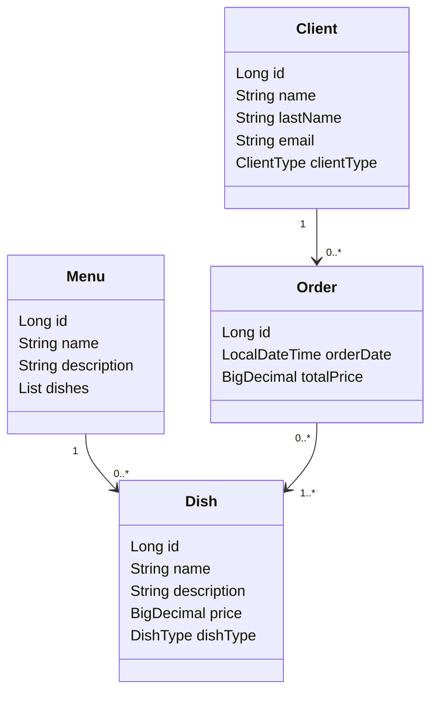
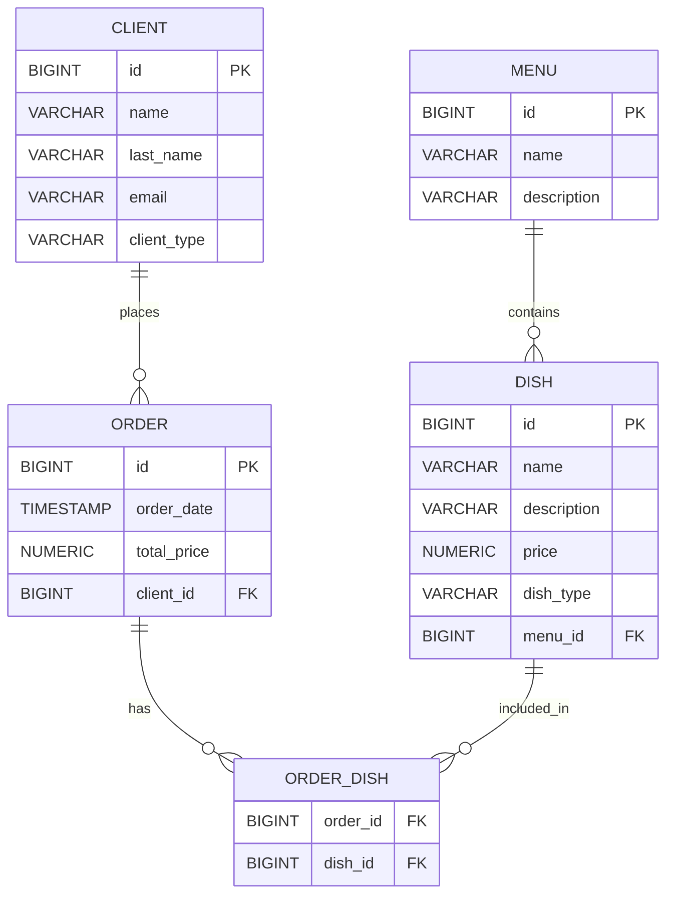

# Restaurant Management API

> REST API desarrollada en Java con Spring Boot
> 
> Enfoque en buenas prácticas, diseño limpio y configuración por entorno

## 📋 Descripción General
Restaurant Management API es una aplicación backend desarrollada en Java + Spring Boot que modela un sistema de gestión de restaurantes.
Permite administrar clientes, menús, platos y órdenes, aplicando principios de diseño orientado a objetos, separación de capas y configuración flexible por entorno.

El proyecto está pensado como backend demostrativo para portfolio, priorizando claridad, mantenibilidad y criterio técnico por sobre complejidad innecesaria

## ⚙️ Tecnologías Utilizadas
- **Java 17**
- **Spring Boot**
- **Spring Data JPA (Hibernate)**
- **PostgreSQL**
- **Gradle**
- **Swagger / OpenAPI**
- **Jakarta Validation**
- **JUnit 5 + Mockito**
- **Lombok**

### 🧠 Decisiones Técnicas Relevantes
- **Uso de DTOs inmutables** (Java Records) para transporte de datos.
- **BigDecimal** para el manejo de precios y valores monetarios.
- **Separación clara entre Controller / Service / Repository.**
- **Uso de transacciones** (@Transactional) en la capa de servicio.
- **Validaciones declarativas** con Jakarta Validation.
- Configuración externa mediante **variables de entorno**.
- **Perfiles de Spring** para separar configuración dev y prod.

---

## 📦 Modelo de Dominio

### Entidades Principales
- **Client**: Representa a los clientes con datos personales y su tipo (común o frecuente).
- **Menu**: Contiene los menús disponibles, cada uno asociado con una lista de platos.
- **Dish**: Representa los platos con detalles como nombre, descripción, precio y tipo (común o popular).
- **Order**: Registra las órdenes de los clientes, cada una con una lista de platos seleccionados.

### Relaciones
- Un cliente puede realizar múltiples órdenes.
- Una órden debe contener al menos un plato.
- Los platos están asociados a un menú.
- Una relación muchos-a-muchos entre platos y órdenes.

---

## Instalación y Ejecución

### 1. Prerrequisitos
- **Java 17** o superior.
- **Gradle**.
- **PostgreSQL 16+**.

### 2. Base de Datos (Entorno Local)

#### Crear la base de datos:
```sql
CREATE DATABASE restaurant_management;
```
_El esquema se genera automáticamente a partir de las entidades JPA._


### 3. Variables de Entorno
**Crear el archivo .env en la raíz del proyecto (no versionado):**
```bash
SPRING_PROFILES_ACTIVE=dev

DB_URL=jdbc:postgresql://localhost:5432/restaurant_management
DB_USERNAME=postgres
DB_PASSWORD=

DDL_AUTO=update
SHOW_SQL=true
```

**Cargar variables y ejecutar:**
```bash
export $(cat .env | xargs)
./gradlew bootRun
```

### 4. Acceso a la API

- **API base:** 

`http://localhost:8080/api/v1`

- **Documentación Swagger:**

`http://localhost:8080/swagger-ui.html`

---

## 🔗 Endpoints Principales

### Client
- **GET** `/clients`: Obtiene todos los clientes.
- **POST** `/clients`: Crea un nuevo cliente.
- **GET** `/clients/{id}`: Obtiene un cliente por su ID.
- **PUT** `/clients/{id}`: Actualiza un cliente.
- **DELETE** `/clients/{id}`: Elimina un cliente.

### Menu
- **GET** `/menus`: Obtiene todos los menús.
- **POST** `/menus`: Crea un nuevo menú.
- **GET** `/menus/{id}`: Obtiene un menú por su ID.
- **PUT** `/menus/{id}`: Actualiza un menú.
- **DELETE** `/menus/{id}`: Elimina un menú.

### Dish
- **GET** `/dishes`: Obtiene todos los platos.
- **POST** `/dishes`: Crea un nuevo plato.
- **GET** `/dishes/{id}`: Obtiene un plato por su ID.
- **PUT** `/dishes/{id}`: Actualiza un plato.
- **DELETE** `/dishes/{id}`: Elimina un plato.

### Order
- **GET** `/orders`: Obtiene todas las órdenes.
- **POST** `/orders`: Crea una nueva órden.
- **GET** `/orders/{id}`: Obtiene una órden por su ID.
- **PUT** `/orders/{id}`: Actualiza una órden.
- **DELETE** `/orders/{id}`: Elimina una órden.

---

## 📐 Diagrama de Clases (UML)


El sistema cuenta con un diagrama UML que describe las relaciones entre las entidades:
- Asociaciones: `1..*`, `0..*` según los requisitos del negocio.
- Tipos de relaciones: composición y agregación.

---

## 📐 Diagrama Relacional



El diagrama relacional representa las relaciones entre las tablas de la base de datos utilizadas en el sistema de gestión de restaurantes. 
Este modelo incluye las claves primarias, claves foráneas y las relaciones (1:1, 1:N, N:M) entre las tablas.

### Relación entre las tablas

- **Client**: Relacionado con **Order** (1 Cliente puede tener 0 o más Órdenes).
- **Order**: Relacionado con **Dish** (N:M) y con **Client** (N:1).
- **Dish**: Relacionado con **Menu** (N:1) y **Order** (N:M).
- **Menu**: Relacionado con **Dish** (1:N).

---

## 👤 Autor
Proyecto desarrollado por **Nahuel Lemes**.
- GitHub: [NahuLemesF](https://github.com/NahuLemesF)
- LinkedIn: [Nahuel Lemes](https://www.linkedin.com/in/nahuel-lemes/)

---

## 📝 Notas
- El proyecto está pensado para uso **demostrativo / educativo**.
- En entorno local se utiliza PostgreSQL con usuario `postgres`.
- En un entorno productivo real, las credenciales y configuraciones deben ajustarse mediante variables de entorno seguras.

